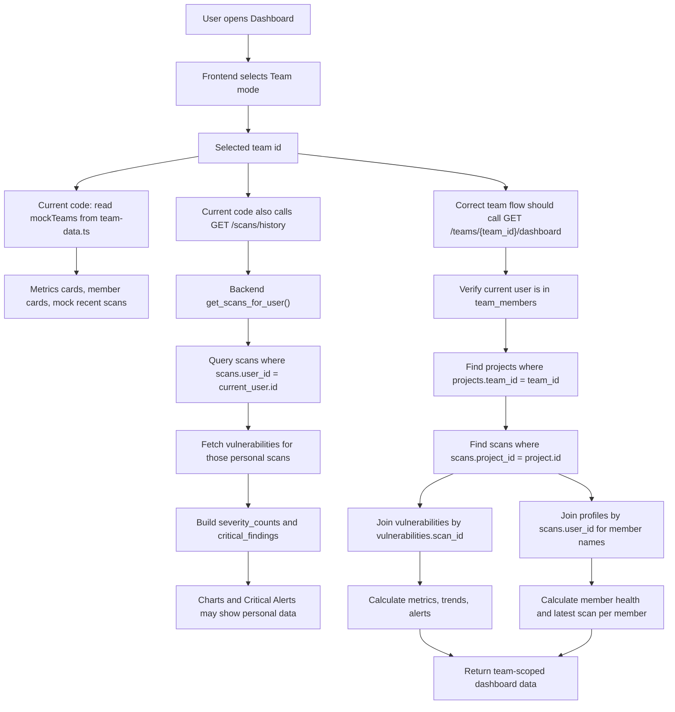

# Team Dashboard Backend/Data Flow

This note explains how the current code works for the Team dashboard shown in the screenshots, which database columns are team-related, and which dashboard widgets are currently team-scoped vs still using personal/user-scoped data.

## Main Finding

The current dashboard does **not** have a dedicated backend endpoint for team dashboard metrics.

In `frontend/src/pages/Dashboard.tsx`, the Team dashboard is a mix of:

- Mock team data from `frontend/src/lib/team-data.ts`
- Personal scan history from `GET /scans/history`
- Realtime subscriptions on `scans` and `alerts`, but without a real team filter

So the values in the screenshot like:

- Total Scans = `512`
- Critical Vulns = `28`
- Team Health Score = `79`
- Team member cards like `John Doe`, `Ali Hassan`, `Sara Kim`

come from `mockTeams` in `frontend/src/lib/team-data.ts`, not from the backend database.

## Tables And Columns Relevant To Team Work

### `teams`

Team identity and GitHub connection.

Important columns:

| Column | Purpose |
|---|---|
| `id` | Team id. Used by `team_members.team_id` and `projects.team_id`. |
| `name` | Team display name, for example `SecureGuard Team`. |
| `github_repo` | Connected GitHub repository URL. |
| `github_branches` | Branches fetched from GitHub. Added by later migrations/services. |
| `github_installation_id` | GitHub App installation id for fetching repo/branch/file data. |
| `github_oauth_token` | Temporary OAuth state/token staging field. |
| `created_by` | User who created the team. |
| `created_at`, `updated_at` | Timestamps. |

Backend usage:

- `backend/app/services/teams/team_service.py`
- `backend/app/services/teams/github_service.py`
- `backend/app/routers/teams.py`

### `team_members`

Connects users to teams and stores team roles/branch assignment.

Important columns:

| Column | Purpose |
|---|---|
| `id` | Team membership row id. |
| `team_id` | Which team this member belongs to. |
| `user_id` | Which auth user this member is. |
| `role` | `admin`, `developer`, or `viewer`. |
| `branches` | Branches assigned to this member. Current backend uses this column. |
| `branch` | Older/single-branch column. Some migrations convert it to `TEXT[]`, but current backend mostly uses `branches`. |
| `created_at`, `updated_at` | Membership timestamps. |

Backend usage:

- `require_member()` checks if user belongs to team.
- `require_admin()` checks if user role is `admin`.
- `update_team_member()` updates `role` and `branches`.
- GitHub branch access checks use the member branch assignment.

### `profiles`

User display information.

Important columns:

| Column | Purpose |
|---|---|
| `id` | Same as `auth.users.id`. Joined with `team_members.user_id`. |
| `full_name` | Member display name. |
| `avatar_url` | Member avatar. |
| `created_at`, `updated_at` | Timestamps. |

Where member names should come from:

- `team_members.user_id -> profiles.id -> profiles.full_name`

Current screenshot names like `John Doe`, `Ali Hassan`, `Sara Kim` are mock values from `frontend/src/lib/team-data.ts`, not database values.

### `projects`

Projects can be personal or team-owned.

Important columns:

| Column | Purpose |
|---|---|
| `id` | Project id, referenced by `scans.project_id`. |
| `name` | Project name. Used by scan/dashboard display. |
| `type` | `personal` or `team`. |
| `owner_id` | User who owns/created the project. |
| `team_id` | If this is a team project, this links it to `teams.id`. |
| `language` | Project language. |
| `health_score` | Letter grade field, not currently used for the dashboard numeric Team Health Score. |
| `created_at`, `updated_at` | Timestamps. |

This is the main bridge for real team dashboard data:

```text
teams.id
  -> projects.team_id
  -> scans.project_id
  -> vulnerabilities.scan_id
```

### `scans`

Stores scan summaries.

Important columns:

| Column | Purpose |
|---|---|
| `id` | Scan id. |
| `project_id` | Links scan to a project. Team scope is indirect through `projects.team_id`. |
| `user_id` | User who started the scan. Useful for per-member stats. |
| `status` | `completed` or `failed` in current persisted flow. Old enum also has `pending`, `in_progress`. |
| `project_name` | Stored display name for scan/project. |
| `scan_type` | `upload` or `github`. |
| `file_name` | Uploaded file names. |
| `file_path` | File path, mostly from scanner/vulnerability context. |
| `branch` | GitHub branch scanned. Important for team member branch display/stat attribution. |
| `risk_level` | Overall risk level from scanner. |
| `risk_score` | Numeric scanner score. This can be used for health score calculation. |
| `total_vulns` | Total vulnerabilities found in this scan. |
| `files_scanned` | Number of files analyzed. |
| `duration_secs` | Scan duration. |
| `error_message` | Failed scan reason. |
| `started_at`, `completed_at`, `created_at`, `updated_at` | Dates used for recent scans and trends. |

Current backend scan insert:

- `backend/app/services/scans/scan_storage_service.py`
- `create_scan_record()` inserts `project_id`, `user_id`, `status`, `project_name`, `scan_type`, `file_name`, `file_path`, `branch`, `risk_level`, `risk_score`, `total_vulns`, `files_scanned`, `duration_secs`.

Important limitation:

- There is no `team_id` column in `scans`.
- Team scope must be found by joining `scans.project_id` to `projects.id`, then filtering `projects.team_id`.

### `vulnerabilities`

Stores individual findings for each scan.

Important columns:

| Column | Purpose |
|---|---|
| `id` | Vulnerability id. |
| `scan_id` | Links finding to `scans.id`. |
| `severity` | `critical`, `high`, `medium`, or `low`. |
| `type` | Vulnerability type/name. |
| `cwe_id` | CWE id, for example `CWE-788`. |
| `cwe_name` | CWE name. |
| `line_number` | Line number in chunk/file context. |
| `absolute_line` | Absolute source line number. |
| `description` | Finding description. |
| `fix_suggestion` | Fix recommendation. |
| `function_name` | Function where vulnerability was found. |
| `file_path` | File containing vulnerability. |
| `code_snippet` | Affected code. |
| `location` | Extra location text from scanner. |
| `created_at` | Finding creation time. |

Dashboard graphs and alerts should count/filter this table by joining through `scans` and `projects`.

### `alerts`

Stores alert state for vulnerabilities.

Important columns:

| Column | Purpose |
|---|---|
| `id` | Alert id. |
| `vulnerability_id` | Links to `vulnerabilities.id`. |
| `user_id` | Alert owner/user. Current table is user-scoped, not team-scoped. |
| `status` | `open`, `acknowledged`, or `resolved`. |
| `created_at`, `updated_at` | Alert timestamps. |

Current limitation:

- `alerts` has no `team_id`.
- To show team alerts, join `alerts.vulnerability_id -> vulnerabilities.id -> scans.id -> projects.team_id`.
- Current dashboard often bypasses `alerts` and builds `CriticalAlerts` from scan `critical_findings`.

## Screenshot Widgets: Current Source Vs Correct Team Source

### 1. Total Scans Card

Current code:

- In personal mode, `Dashboard.tsx` uses `rawScans.length`.
- `rawScans` comes from `getScanHistory()`.
- `getScanHistory()` calls `GET /scans/history`.
- Backend `get_scans_for_user()` filters only `scans.user_id = current_user.id`.
- In team mode, `Dashboard.tsx` uses `selectedTeam.metrics.totalScans` from mock data.

Current screenshot value `512`:

- From `frontend/src/lib/team-data.ts`
- `mockTeams[0].metrics.totalScans`

Correct database columns for real team Total Scans:

- `projects.team_id`
- `scans.project_id`
- `scans.status`
- `scans.created_at`

Correct query logic:

```sql
SELECT count(*)
FROM scans s
JOIN projects p ON p.id = s.project_id
WHERE p.team_id = :team_id;
```

If only completed scans should count:

```sql
AND s.status = 'completed'
```

### 2. Critical Vulns Card

Current code:

- In personal mode, calculated from `rawScans.reduce(...)` using `scan.severity_counts.critical`.
- `severity_counts` is built in backend `get_scans_for_user()` by reading vulnerabilities for personal/user scans only.
- In team mode, card uses `selectedTeam.metrics.criticalVulns` from mock data.

Current screenshot value `28`:

- From `frontend/src/lib/team-data.ts`
- `mockTeams[0].metrics.criticalVulns`

Correct database columns for real team Critical Vulns:

- `projects.team_id`
- `scans.project_id`
- `vulnerabilities.scan_id`
- `vulnerabilities.severity`

Correct query logic:

```sql
SELECT count(*)
FROM vulnerabilities v
JOIN scans s ON s.id = v.scan_id
JOIN projects p ON p.id = s.project_id
WHERE p.team_id = :team_id
  AND v.severity = 'critical';
```

### 3. Team Health Score Card

Current code:

- In personal mode:

```ts
healthScore = totalScans > 0
  ? Math.round((completedScans / totalScans) * 100)
  : 100
```

- In team mode, `Dashboard.tsx` uses `selectedTeam.metrics.healthScore`.

Current screenshot value `79`:

- From `frontend/src/lib/team-data.ts`
- `mockTeams[0].metrics.healthScore`

Correct database columns for real team health:

- `projects.team_id`
- `scans.project_id`
- `scans.status`
- `scans.risk_score`
- `scans.total_vulns`
- `vulnerabilities.severity`

There is no backend-defined formula for Team Health Score yet.

Possible real formulas:

1. Average latest scan `risk_score` inverted/normalized.
2. Completion rate like personal mode.
3. Weighted score based on severity counts.

Example severity-based formula:

```text
team_health = 100
  - critical_count * 10
  - high_count * 5
  - medium_count * 2
  - low_count * 1
```

Then clamp between `0` and `100`.

## Team Health Overview: Member Cards

Current code:

- Component: `frontend/src/components/dashboard/TeamHealthOverview.tsx`
- Data source: `team.members`
- Passed from `selectedTeam`, which currently comes from `mockTeams`.

Fields shown:

| UI Field | Current Source | Real DB Source |
|---|---|---|
| Initials like `JD` | `mockTeams.members.initials` | Derive from `profiles.full_name`. |
| Name like `John Doe` | `mockTeams.members.name` | `profiles.full_name`. |
| `You` badge | `member.id === CURRENT_USER_ID` | `team_members.user_id === current_user.id`. |
| Branch like `main` | `mockTeams.members.branch` | `team_members.branches` or latest `scans.branch`. |
| Health score like `92` | `mockTeams.members.healthScore` | Must be calculated from that member's team scans. |
| Last scan like `30 min ago` | `mockTeams.members.lastScan` | Latest `scans.created_at` or `scans.completed_at` for that member/team. |

Real member flow:

```text
GET /teams
  -> backend list_user_teams()
  -> team_members rows for current user
  -> teams rows
  -> all team_members rows for those teams
  -> profiles rows for member names
  -> frontend receives TeamResponse.members
```

Real database path:

```text
teams.id
  -> team_members.team_id
  -> team_members.user_id
  -> profiles.id
  -> profiles.full_name
```

For each member's health/last scan:

```text
team_members.user_id
  -> scans.user_id
  -> scans.project_id
  -> projects.id
  -> projects.team_id = selected team
```

Example latest scan query per member:

```sql
SELECT s.*
FROM scans s
JOIN projects p ON p.id = s.project_id
WHERE p.team_id = :team_id
  AND s.user_id = :member_user_id
ORDER BY s.created_at DESC
LIMIT 1;
```

## Recent Scans In Team Dashboard

Current code:

- Component: `frontend/src/components/dashboard/RecentScansTable.tsx`
- In `Dashboard.tsx`, `getScans()` decides what to pass.

Current behavior:

1. If realtime scans exist:
   - It maps all realtime scan rows.
   - Developer role tries to filter by `s.team_id === selectedTeamId`.
   - But `ScanRecord`/database `scans` does not have a real `team_id` column.
   - Admin/viewer path returns all realtime scans, not selected team scans.

2. If realtime scans do not exist:
   - Personal view uses `recentScans` from `GET /scans/history`.
   - Team view uses `selectedTeam.scans`, which is mock data from `team-data.ts`.

So the team Recent Scans table in the screenshot is currently mock data, not backend team scan history.

Correct database columns for real team Recent Scans:

| UI Field | Real DB Columns |
|---|---|
| Project | `scans.project_name`, fallback `projects.name`, `scans.file_name`, `scans.branch` |
| Date | `scans.created_at`, `scans.started_at`, or `scans.completed_at` |
| Status | `scans.status` |
| Vulnerability badges | Count `vulnerabilities.severity` grouped by `scan_id` |
| Report action | `scans.id`, `scans.report_storage_path`, `reports.scan_id` |
| Team filter | `projects.team_id` |
| Member filter | `scans.user_id` |
| Branch | `scans.branch` |

Correct query flow:

```text
selectedTeamId
  -> projects where projects.team_id = selectedTeamId
  -> scans where scans.project_id in team project ids
  -> vulnerabilities where vulnerabilities.scan_id in scan ids
  -> group vulnerabilities by scan and severity
  -> return latest 5 scans
```

Example SQL:

```sql
SELECT s.*
FROM scans s
JOIN projects p ON p.id = s.project_id
WHERE p.team_id = :team_id
ORDER BY s.created_at DESC
LIMIT 5;
```

Then fetch vulnerabilities:

```sql
SELECT scan_id, severity, count(*)
FROM vulnerabilities
WHERE scan_id IN (:scan_ids)
GROUP BY scan_id, severity;
```

## Vulnerability Trend, Bar Chart, Pie Chart

Current code:

- `Dashboard.tsx` builds `vulnerabilityTrend` from `rawScans`.
- `rawScans` comes from `GET /scans/history`.
- Backend filters this by `scans.user_id = current_user.id`.

So even in team mode:

- `VulnerabilityChart`
- `VulnerabilityBarChart`
- `VulnerabilityPieChart`

are currently based on the logged-in user's personal scan history, not selected team data.

Correct database columns for team graphs:

- `projects.team_id`
- `scans.project_id`
- `scans.status`
- `scans.created_at`
- `vulnerabilities.scan_id`
- `vulnerabilities.severity`

Correct trend query:

```sql
SELECT
  date_trunc('day', s.created_at) AS day,
  v.severity,
  count(*) AS count
FROM vulnerabilities v
JOIN scans s ON s.id = v.scan_id
JOIN projects p ON p.id = s.project_id
WHERE p.team_id = :team_id
  AND s.status = 'completed'
GROUP BY day, v.severity
ORDER BY day;
```

Chart data shape expected by frontend:

```ts
{
  date: "Jun 2",
  critical: 3,
  high: 7,
  medium: 14
}
```

Pie chart uses the same data but aggregates totals by severity.

Bar chart uses the same date/severity grouped data.

## Critical Alerts In Team Dashboard

Current code:

- Component: `frontend/src/components/dashboard/CriticalAlerts.tsx`
- Priority order is:
  1. `scanAlerts`
  2. `realtimeAlerts`
  3. `teamAlerts`

Important issue:

- `scanAlerts` is always passed from `Dashboard.tsx`.
- It is built from `rawScans.critical_findings`.
- `rawScans` comes from `/scans/history`, which is personal/user-scoped.

Therefore, in team mode, Critical Alerts can still show personal scan critical findings instead of selected team findings.

Current team mock fallback:

- `selectedTeam.alerts` exists in `team-data.ts`
- But because `scanAlerts` has priority, the mock team alerts are only used if there are no `scanAlerts`.

Correct database columns for real team critical alerts:

| UI Field | Real DB Columns |
|---|---|
| Alert title | `vulnerabilities.cwe_id`, `vulnerabilities.cwe_name`, `vulnerabilities.type`, `vulnerabilities.line_number` |
| Project | `scans.project_name` or `projects.name` |
| Time | `vulnerabilities.created_at` or `alerts.created_at` |
| Member name | `scans.user_id -> profiles.id -> profiles.full_name` |
| Branch | `scans.branch` |
| Team filter | `projects.team_id` |
| Alert status | `alerts.status` if using alerts table |

Correct query flow:

```text
selectedTeamId
  -> projects.team_id
  -> scans.project_id
  -> vulnerabilities.scan_id
  -> severity = critical
  -> optional alerts.vulnerability_id
  -> profiles for scan.user_id member name
```

Example SQL:

```sql
SELECT
  v.id,
  v.cwe_id,
  v.cwe_name,
  v.type,
  v.line_number,
  v.file_path,
  v.created_at,
  s.project_name,
  s.branch,
  pr.full_name AS member_name
FROM vulnerabilities v
JOIN scans s ON s.id = v.scan_id
JOIN projects p ON p.id = s.project_id
LEFT JOIN profiles pr ON pr.id = s.user_id
WHERE p.team_id = :team_id
  AND v.severity = 'critical'
ORDER BY v.created_at DESC
LIMIT 10;
```

## How Team GitHub Scans Are Saved

Team GitHub scan route:

```text
POST /teams/{team_id}/scans
```

Backend file:

```text
backend/app/routers/scans.py
```

Flow:

```text
Frontend triggerScan(teamId, branch, selectedFiles, project_id, project_name)
  -> POST /teams/{team_id}/scans
  -> scanner_service.fetch_selected_code_hybrid(team_id, branch, selected_files, current_user.id)
  -> verifies team membership/branch access
  -> fetches selected files from GitHub
  -> run_vulnerability_scanner(files_dict)
  -> create_scan_record(...)
  -> save_vulnerabilities(...)
  -> save_report_artifact(...)
```

Important detail:

- The route receives `team_id`, but `create_scan_record()` does not save `team_id`.
- The team relationship only survives if the frontend sends a `project_id` for a project where `projects.team_id = team_id`.
- If `project_id` is empty or points to a personal project, the scan cannot be reliably included in real team dashboard queries.

## Current Backend Endpoints Relevant To Teams

| Endpoint | Purpose |
|---|---|
| `GET /teams` | Lists teams current user belongs to. Includes members/profiles. |
| `GET /teams/{team_id}` | Gets one team. |
| `POST /teams` | Creates team. |
| `PATCH /teams/{team_id}` | Updates team name/repo. |
| `POST /teams/{team_id}/members` | Invites member. |
| `PATCH /teams/{team_id}/members/{user_id}` | Updates role/branches. |
| `GET /teams/{team_id}/branches/{branch}/files` | Lists GitHub files for branch. |
| `GET /teams/{team_id}/branches/{branch}/files/content` | Gets GitHub file content. |
| `POST /teams/{team_id}/scans` | Runs GitHub team scan. |
| `GET /scans/history` | Current user's scans only. Not team dashboard endpoint. |

Missing endpoint:

```text
GET /teams/{team_id}/dashboard
```

or separate endpoints:

```text
GET /teams/{team_id}/dashboard/metrics
GET /teams/{team_id}/dashboard/recent-scans
GET /teams/{team_id}/dashboard/trends
GET /teams/{team_id}/dashboard/critical-alerts
GET /teams/{team_id}/dashboard/member-health
```

## Recommended Real Team Dashboard Response

A practical backend response could be:

```json
{
  "metrics": {
    "totalScans": 512,
    "criticalVulns": 28,
    "healthScore": 79
  },
  "members": [
    {
      "userId": "uuid",
      "name": "John Doe",
      "initials": "JD",
      "role": "admin",
      "branches": ["main"],
      "healthScore": 92,
      "lastScanAt": "2026-06-02T14:58:00Z"
    }
  ],
  "recentScans": [
    {
      "id": "scan_uuid",
      "projectName": "auth-service",
      "date": "2026-06-02T15:58:00Z",
      "status": "completed",
      "branch": "feature/login",
      "memberName": "Ali Hassan",
      "vulnerabilities": {
        "critical": 3,
        "high": 7,
        "medium": 14,
        "low": 20
      }
    }
  ],
  "vulnerabilityTrend": [
    {
      "date": "Jun 2",
      "critical": 3,
      "high": 7,
      "medium": 14
    }
  ],
  "criticalAlerts": [
    {
      "id": "vulnerability_uuid",
      "title": "CWE-788 at line 23",
      "project": "auth-service",
      "memberName": "Ali Hassan",
      "branch": "feature/login",
      "createdAt": "2026-06-02T14:54:41Z"
    }
  ]
}
```

## Complete Team Dashboard Flow



## Short Answer To Your Main Questions

### Which columns are for team?

Main team columns:

- `teams.id`
- `teams.name`
- `teams.github_repo`
- `teams.github_branches`
- `teams.github_installation_id`
- `teams.created_by`
- `team_members.team_id`
- `team_members.user_id`
- `team_members.role`
- `team_members.branches`
- `projects.team_id`
- `projects.type`

Team dashboard scan data uses:

- `projects.team_id`
- `scans.project_id`
- `scans.user_id`
- `scans.status`
- `scans.project_name`
- `scans.branch`
- `scans.risk_score`
- `scans.total_vulns`
- `scans.created_at`
- `vulnerabilities.scan_id`
- `vulnerabilities.severity`
- `vulnerabilities.cwe_id`
- `vulnerabilities.line_number`
- `profiles.full_name`

### How are Total Scans, Critical Vulns, and Team Health Score updated now?

In the current Team dashboard screenshot, they are **not updated from backend database**.

They come from:

```text
frontend/src/lib/team-data.ts
  -> mockTeams[].metrics.totalScans
  -> mockTeams[].metrics.criticalVulns
  -> mockTeams[].metrics.healthScore
```

### Where does each team member name come from now?

In the screenshot, member names come from:

```text
frontend/src/lib/team-data.ts
  -> mockTeams[].members[].name
```

In the real backend, names should come from:

```text
team_members.user_id
  -> profiles.id
  -> profiles.full_name
```

### How does Recent Scans update in Team dashboard now?

Current Team mode fallback uses:

```text
selectedTeam.scans
```

from mock data.

If realtime scan rows exist, the code maps realtime `scans` rows, but the team filter is not reliable because the real `scans` table does not store `team_id`.

Correct team recent scans should use:

```text
projects.team_id = selectedTeamId
scans.project_id = projects.id
```

### Are graphs team-based now?

No. Vulnerability trend, pie, and bar charts are currently built from `rawScans`, which comes from:

```text
GET /scans/history
  -> scans.user_id = current_user.id
```

So they are personal/user-scoped, even while Team mode is selected.

### Are Critical Alerts team-based now?

Not reliably.

Current priority is:

```text
scanAlerts from personal /scans/history
then realtimeAlerts
then selectedTeam.alerts mock data
```

So team mode can show personal critical alerts. Correct team alerts should join:

```text
projects.team_id
  -> scans.project_id
  -> vulnerabilities.scan_id
  -> severity = critical
```

